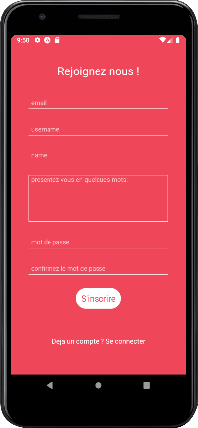
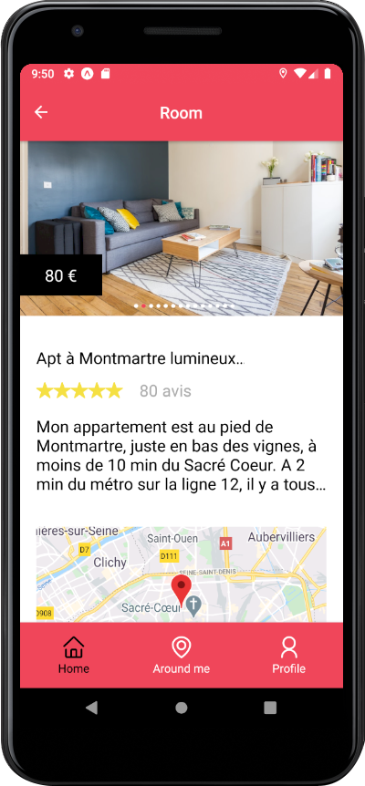
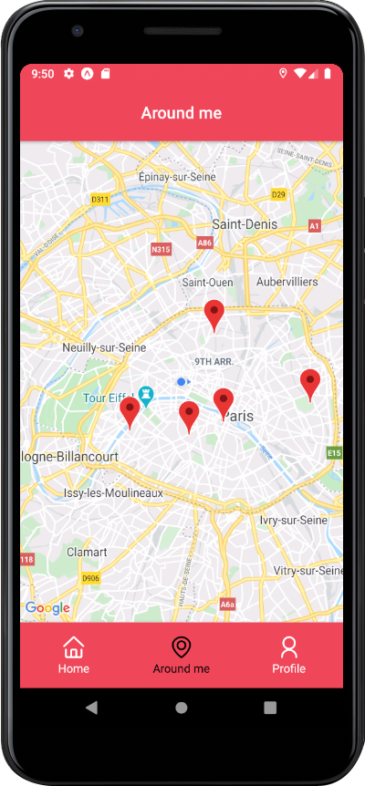

<h1 align="center">
	Airbnb Clone - React Native
</h1>

<p align="center">
	
</p>

## Overview

**Airbnb Clone done during training to learn React Native at [Le Reacteur](https://www.lereacteur.io/) Bootcamp.**  
6 screens are availables : Login, Signup, Home, Room, Around Me and Profile.

## Screenshots








## Packages

- [React Navigation v5](https://reactnavigation.org/)
- [React Native Maps](https://github.com/react-native-community/react-native-maps)
- [Axios](https://github.com/axios/axios)
- [React Native Image Picker](https://github.com/react-native-community/react-native-image-picker)
- [Expo Location](https://docs.expo.io/versions/latest/sdk/location/)
- [Expo Permissions](https://docs.expo.io/versions/latest/sdk/permissions/)
- [React Native Swiper Flatlist](https://www.npmjs.com/package/react-native-swiper-flatlist)

## Installation and usage

Be sure, you have installed all dependencies and applications to run React Native Expo project on your computer : [Getting Started with React Native](https://facebook.github.io/react-native/docs/getting-started).

This project works pretty fine for iOS **and** Android.

### Running the project

Clone this repository :

```
git clone https://github.com/stephanebouillot/airbnb-react-native.git
cd airbnb-react-native
```

Install packages :

```
npm install
```

or

```
yarn
```

When installation is complete :

```bash
expo start
```
